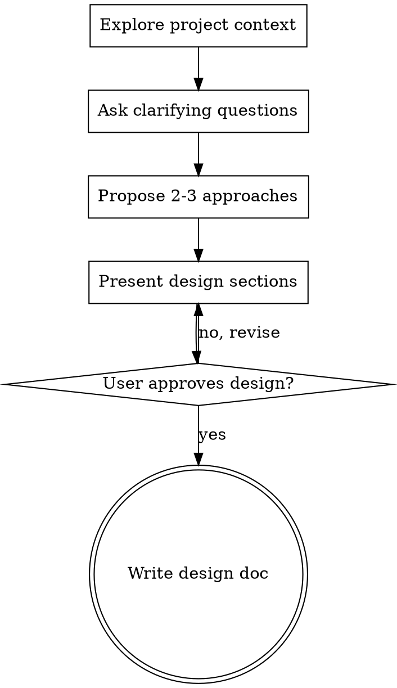

# `/design` Skill Implementation Plan

> **For Claude:** Use superpowers:executing-plans (simple/fast) or superpowers:subagent-driven-development (fresh context + reviews) to implement this plan.

**Goal:** Implement the `/design` skill by copying the brainstorming skill with minimal adaptations.

**Architecture:** Single file rewrite — replace the stub SKILL.md with the full process skill content adapted from brainstorming.

**Tech Stack:** Claude Code skill (SKILL.md only, no templates)

**Design Doc:** `.plans/2026-03-01-design-skill-design.md`

---

## Task 1: Rewrite SKILL.md

**Files:**
- Modify: `plugins/dev-workflow/skills/design/SKILL.md`

**Step 1: Read source skill for reference**

Run: `cat /Users/D038720/.claude/plugins/cache/overrides/dev-skills-superpowers/0.0.1/skills/brainstorming/SKILL.md`

Alternatively read from: `plugins/dev-skills-superpowers/skills/brainstorming/SKILL.md`

**Step 2: Rewrite SKILL.md with adapted content**

Replace entire file with:

```markdown
---
name: design
description: "Brainstorm and create design specs. Outputs to .agent/design/. Part of workflow: init → prime → research → design → plan → implement → status → verify → release → retro"
---

# /design

## Overview

Help turn ideas into fully formed designs and specs through natural collaborative dialogue.

Start by understanding the current project context, then ask questions one at a time to refine the idea. Once you understand what you're building, present the design and get user approval.

<HARD-GATE>
Do NOT invoke any implementation skill, write any code, scaffold any project, or take any implementation action until you have presented a design and the user has approved it. This applies to EVERY project regardless of perceived simplicity.
</HARD-GATE>

## Anti-Pattern: "This Is Too Simple To Need A Design"

Every project goes through this process. A todo list, a single-function utility, a config change — all of them. "Simple" projects are where unexamined assumptions cause the most wasted work. The design can be short (a few sentences for truly simple projects), but you MUST present it and get approval.

## Checklist

You MUST create a task for each of these items and complete them in order:

1. **Explore project context** — check files, docs, recent commits
2. **Ask clarifying questions** — one at a time, understand purpose/constraints/success criteria
3. **Propose 2-3 approaches** — with trade-offs and your recommendation
4. **Present design** — in sections scaled to their complexity, get user approval after each section
5. **Write design doc** — save to `.agent/design/YYYY-MM-DD-<topic>.md` and commit

## Process Flow



## Output

Writes to: `.agent/design/YYYY-MM-DD-<topic>.md`

## The Process

**Understanding the idea:**
- Check out the current project state first (files, docs, recent commits)
- Ask questions one at a time to refine the idea
- Prefer multiple choice questions when possible, but open-ended is fine too
- Only one question per message - if a topic needs more exploration, break it into multiple questions
- Focus on understanding: purpose, constraints, success criteria

**Exploring approaches:**
- Propose 2-3 different approaches with trade-offs
- Present options conversationally with your recommendation and reasoning
- Lead with your recommended option and explain why

**Presenting the design:**
- Once you believe you understand what you're building, present the design
- Scale each section to its complexity: a few sentences if straightforward, up to 200-300 words if nuanced
- Ask after each section whether it looks right so far
- Cover: architecture, components, data flow, error handling, testing
- Be ready to go back and clarify if something doesn't make sense

## Workflow

Part of: init → prime → research → **design** → plan → implement → status → verify → release → retro

## Key Principles

- **One question at a time** - Don't overwhelm with multiple questions
- **Multiple choice preferred** - Easier to answer than open-ended when possible
- **YAGNI ruthlessly** - Remove unnecessary features from all designs
- **Explore alternatives** - Always propose 2-3 approaches before settling
- **Incremental validation** - Present design, get approval before moving on
- **Be flexible** - Go back and clarify when something doesn't make sense
```

**Step 3: Verify file content**

Run: `head -30 plugins/dev-workflow/skills/design/SKILL.md`
Expected: Shows frontmatter with `name: design` and `# /design` header

---

## Task 2: Commit changes

**Step 1: Check status**

Run: `git status`
Expected: Shows `plugins/dev-workflow/skills/design/SKILL.md` as modified

**Step 2: Stage and commit**

Run:
```bash
git add plugins/dev-workflow/skills/design/SKILL.md && git commit -m "$(cat <<'EOF'
Implement /design skill based on brainstorming

Adapted from dev-skills-superpowers:brainstorming with:
- Output to .agent/design/YYYY-MM-DD-<topic>.md
- No terminal invocation (user decides next step)
- Added Workflow section for dev-workflow context

Co-Authored-By: Claude Opus 4.6 <noreply@anthropic.com>
EOF
)"
```

**Step 3: Verify commit**

Run: `git log --oneline -1`
Expected: Shows commit message starting with "Implement /design skill"

---

*Plan complete: 2 tasks*
